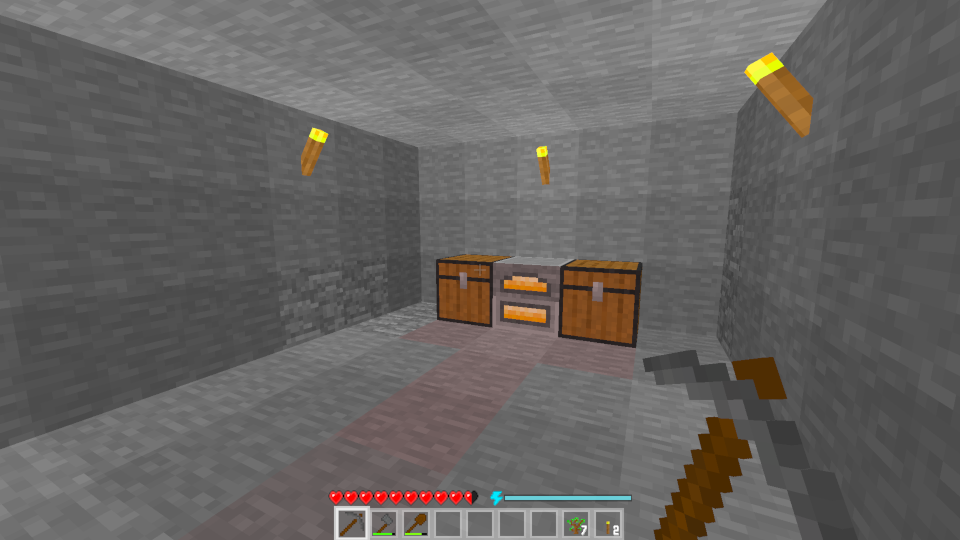
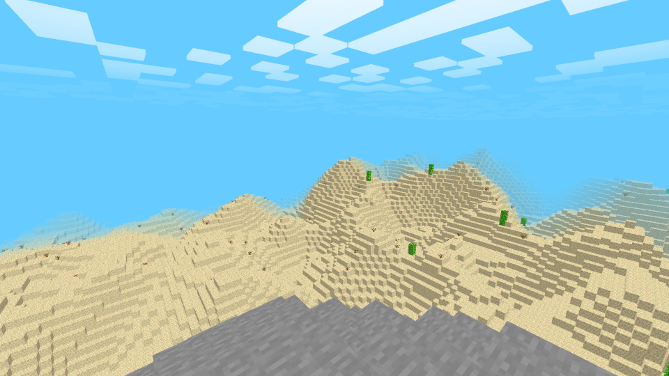

# Voxelworld

Explore and build in a world made out of voxels.

## About

This is a voxel engine/Minecraft clone that I made as a programming challenge
(and for fun). It has two game modes: survival mode and creative mode.
In survival mode you have to explore the world to gather resources in order
to craft tools, make food, and build. In creative mode you have infinte
blocks and can build whatever you want.

***Note:*** Tool progression in this game is slightly different from that of
Minecraft - it goes:

**wood > stone > iron > gold > diamond > rainbow.**

Notice that gold is the tier above iron and the tier below diamond. Therefore,
you need to use gold tools in order to mine and obtain diamonds.

## Controls

 - W, A, S, D to move around
 - Space to jump
 - Left Shift to sprint
 - Left Ctrl to crouch
 - Left Click to break block
 - Right Click to place block (or interact with a block)
 - Scroll wheel to scroll through hotbar
 - Tab to open block selection menu
 - E to open inventory

## Voxel Engine features

 - Cubic chunks - this allows for the player to build infinitely in the vertical 
 direction.
 - Any block can be 'slabified'/'stairified' - block geometry is independent of 
 the actual id of the block which means that stairs and slabs do not need to be
 added seperately - this allows for basically all "full" blocks to automatically
 have a slab and stair variant. There are some rather cursed stairs
 and slabs as a result though...
 - Vertical slabs
 - Colored lighting - lighting is stored in 4 seperate channels: red, green,
 blue, and sky. This allows for RGB block light.

## Compile

The game does not run that well in debug mode so I recommend building with
release (though the compile time might be kind of long):

```
cargo build --release
```

## Screenshots






